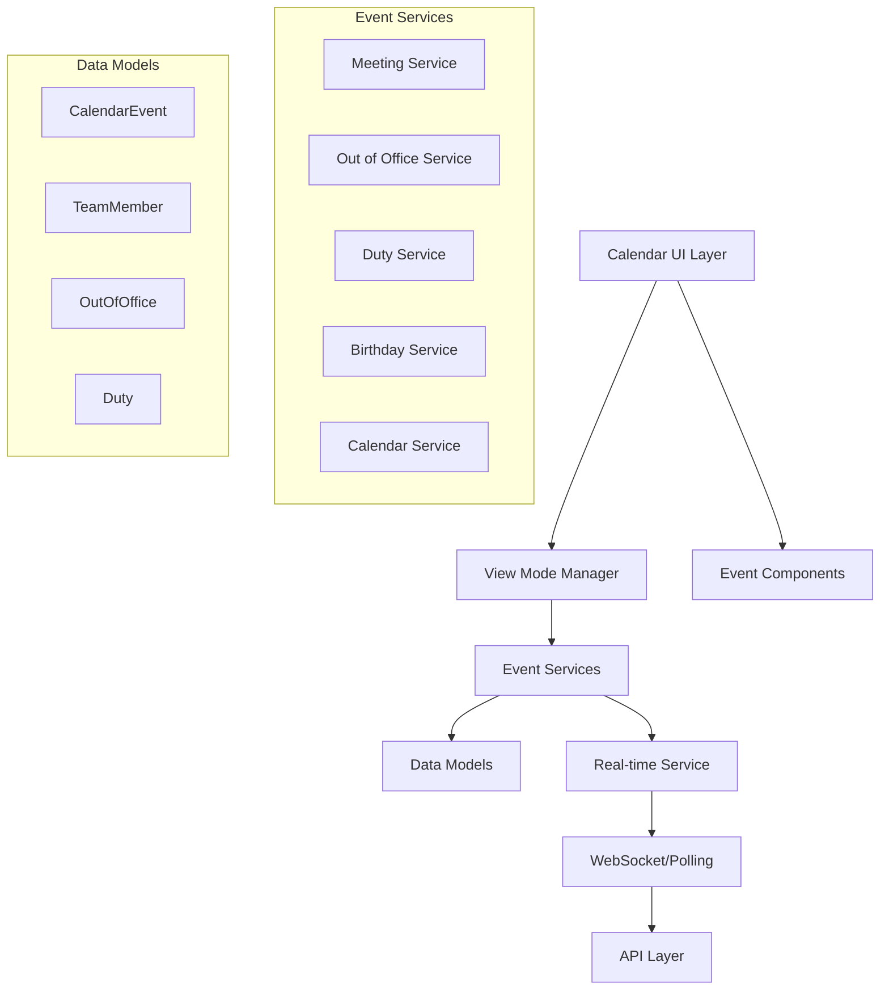

# Design Document

## Overview

This design extends the existing calendar functionality to support multiple view modes that filter and display different types of events. The calendar will support five distinct view modes: Meetings, Out of Office, Duties, Birthdays, and All Events. Additionally, the calendar will implement real-time updates to ensure data consistency when meetings are rescheduled or modified.

The design leverages the existing calendar infrastructure while adding new data models, services, and UI components to support the enhanced functionality.

## Architecture

### High-Level Architecture



### View Mode Architecture

The calendar will use a centralized view mode management system that:
- Maintains current view state
- Filters events based on selected mode
- Persists user preferences
- Coordinates with real-time updates

## Components and Interfaces

### 1. View Mode Manager

**Purpose**: Central state management for calendar view modes

**Interface**:
```javascript
class ViewModeManager {
  // View mode types
  static VIEW_MODES = {
    MEETINGS: 'meetings',
    OUT_OF_OFFICE: 'out_of_office', 
    DUTIES: 'duties',
    BIRTHDAYS: 'birthdays',
    ALL_EVENTS: 'all_events'
  };

  // Current view state
  getCurrentViewMode(): string
  setViewMode(mode: string): void
  
  // Event filtering
  filterEventsForView(events: Array, viewMode: string): Array
  
  // Persistence
  saveViewPreference(mode: string): void
  loadViewPreference(): string
}
```

### 2. Enhanced Calendar Component

**Purpose**: Main calendar display with view mode switching

**Key Features**:
- View mode selector in header
- Event filtering based on selected mode
- Visual distinction for different event types
- Empty state handling per view mode

**New Props**:
```javascript
{
  viewMode: string,
  onViewModeChange: (mode: string) => void,
  realTimeUpdates: boolean
}
```

### 3. Duty Management Components

**Purpose**: New components for managing team member duties

**Components**:
- `DutyForm`: Create/edit duty assignments
- `DutyCard`: Display duty information
- `DutyCalendarEvent`: Calendar-specific duty display

### 4. Real-time Update Service

**Purpose**: Automatic calendar updates when data changes

**Interface**:
```javascript
class RealTimeUpdateService {
  // Update detection
  startPolling(): void
  stopPolling(): void
  
  // Event handlers
  onMeetingUpdate(callback: Function): void
  onOutOfOfficeUpdate(callback: Function): void
  onDutyUpdate(callback: Function): void
  
  // Manual refresh
  forceRefresh(): Promise<void>
}
```

## Data Models

### 1. Enhanced TeamMember Model

**New Fields**:
```javascript
{
  // Existing fields...
  duties: Array<{
    id: string,
    type: 'devops' | 'on_call' | 'other',
    title: string,
    start_date: string,
    end_date: string,
    description?: string
  }>,
  birthday?: string // ISO date string
}
```

### 2. New Duty Entity

**Purpose**: Track multi-day duty assignments

**Schema**:
```javascript
{
  id: string,
  team_member_id: string,
  type: 'devops' | 'on_call' | 'other',
  title: string,
  description?: string,
  start_date: string, // ISO date
  end_date: string,   // ISO date
  created_at: string,
  updated_at: string
}
```

### 3. Enhanced CalendarEvent Model

**New Event Types**:
- `duty`: For duty assignments
- `birthday`: For birthday events
- `out_of_office`: For out-of-office periods

**Enhanced Schema**:
```javascript
{
  // Existing fields...
  event_type: 'meeting' | 'one_on_one' | 'duty' | 'birthday' | 'out_of_office',
  duty_id?: string,        // Link to Duty entity
  out_of_office_id?: string, // Link to OutOfOffice entity
  recurrence?: {           // For recurring events like birthdays
    type: 'yearly' | 'monthly' | 'weekly',
    interval: number
  }
}
```

## Event Filtering Logic

### View Mode Filters

**Meetings View**:
```javascript
events.filter(event => 
  event.event_type === 'meeting' || 
  event.event_type === 'one_on_one'
)
```

**Out of Office View**:
```javascript
events.filter(event => 
  event.event_type === 'out_of_office'
)
```

**Duties View**:
```javascript
events.filter(event => 
  event.event_type === 'duty'
)
```

**Birthdays View**:
```javascript
events.filter(event => 
  event.event_type === 'birthday'
)
```

**All Events View**:
```javascript
// No filtering - show all events
events
```

## Visual Design

### View Mode Selector

**Location**: Calendar header, next to month navigation
**Design**: Tab-style selector with badges showing event counts

```
[Meetings (5)] [Out of Office (2)] [Duties (1)] [Birthdays (3)] [All Events (11)]
```

### Event Visual Styling

**Color Coding**:
- Meetings: Blue (`#3b82f6`)
- Out of Office: Orange (`#f97316`)
- Duties: Purple (`#8b5cf6`)
- Birthdays: Pink (`#ec4899`)

**Event Indicators**:
- Meetings: Calendar icon
- Out of Office: User-X icon
- Duties: Shield icon
- Birthdays: Cake icon

### Multi-day Event Display

**Spanning Events**: Events that span multiple days will show:
- Start indicator on first day
- Continuation bars on middle days
- End indicator on last day

## Real-time Updates

### Update Detection Strategy

**Polling Approach** (Initial Implementation):
- Poll for changes every 30 seconds
- Compare timestamps to detect updates
- Refresh affected view modes only

**Future WebSocket Enhancement**:
- Real-time push notifications
- Immediate UI updates
- Optimistic UI updates with rollback

### Update Handling

**Meeting Updates**:
1. Detect meeting reschedule/modification
2. Update calendar events in memory
3. Refresh calendar display
4. Show brief notification to user

**Data Consistency**:
- Maintain event version numbers
- Handle concurrent updates gracefully
- Provide manual refresh option

## Error Handling

### View Mode Errors

**Empty States**:
- Custom messages per view mode
- Actionable suggestions (e.g., "Add your first duty assignment")

**Data Loading Errors**:
- Graceful degradation to cached data
- Retry mechanisms with exponential backoff
- User-friendly error messages

### Real-time Update Errors

**Network Issues**:
- Fall back to manual refresh
- Show connection status indicator
- Queue updates for when connection restored

**Data Conflicts**:
- Show conflict resolution dialog
- Allow user to choose which version to keep
- Provide merge options where applicable

## Testing Strategy

### Unit Tests

**View Mode Manager**:
- Event filtering logic
- View mode persistence
- State management

**Event Services**:
- Data transformation
- Error handling
- API integration

### Integration Tests

**Calendar Component**:
- View mode switching
- Event display accuracy
- Real-time update handling

**End-to-End Tests**:
- Complete user workflows
- Cross-browser compatibility
- Performance under load

### Performance Tests

**Large Dataset Handling**:
- 1000+ events across multiple years
- View mode switching performance
- Memory usage optimization

**Real-time Update Performance**:
- Update frequency impact
- Network efficiency
- Battery usage on mobile

## Security Considerations

### Data Access Control

**View Permissions**:
- Team members can view all team events
- Peers can view limited event details
- Sensitive duty information protection

**Update Permissions**:
- Only authorized users can modify duties
- Meeting updates require appropriate permissions
- Audit trail for duty assignments

### Real-time Security

**Update Validation**:
- Verify update authenticity
- Prevent unauthorized modifications
- Rate limiting for update requests

## Performance Optimization

### Event Loading Strategy

**Lazy Loading**:
- Load current month events first
- Fetch adjacent months on demand
- Cache frequently accessed data

**View Mode Optimization**:
- Pre-filter events on server side
- Minimize client-side processing
- Efficient event indexing

### Memory Management

**Event Caching**:
- LRU cache for event data
- Automatic cleanup of old events
- Memory usage monitoring

### Network Optimization

**Batch Updates**:
- Group multiple changes together
- Minimize API calls
- Compress update payloads

## Accessibility

### Keyboard Navigation

**View Mode Switching**:
- Tab navigation between modes
- Arrow key navigation within modes
- Enter/Space for selection

**Event Interaction**:
- Keyboard shortcuts for common actions
- Focus management for dialogs
- Screen reader announcements

### Visual Accessibility

**Color Coding**:
- High contrast color schemes
- Pattern/texture alternatives to color
- Colorblind-friendly palette

**Text Alternatives**:
- Alt text for event icons
- Descriptive labels for all controls
- Status announcements for updates

## Migration Strategy

### Existing Data

**Calendar Events**:
- Migrate existing events to new schema
- Preserve all existing functionality
- Add new event type classifications

**Team Member Data**:
- Add birthday and duty fields
- Maintain backward compatibility
- Gradual feature rollout

### User Experience

**Progressive Enhancement**:
- Default to "All Events" view for existing users
- Introduce new features gradually
- Provide onboarding for new view modes

**Feature Flags**:
- Enable view modes per user/team
- A/B test new functionality
- Safe rollback mechanisms