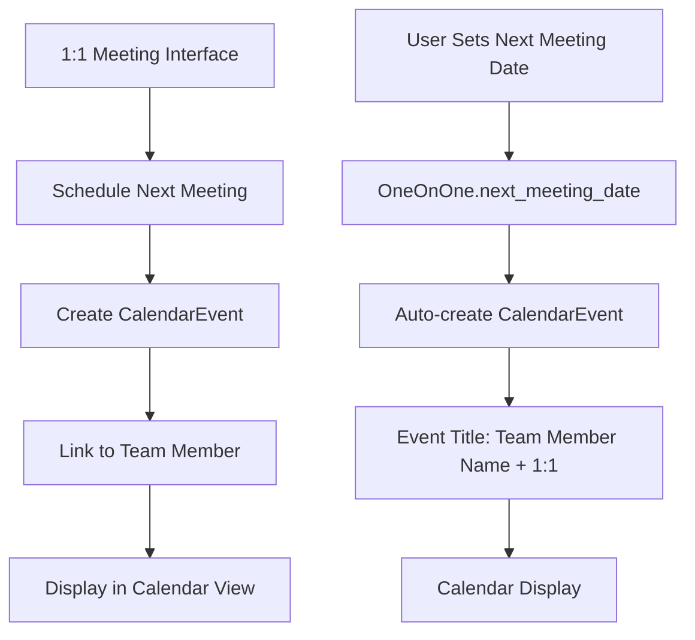

# Design Document

## Overview

This feature adds calendar integration to the 1:1 meeting system by extending the existing OneOnOne entity with calendar event creation capabilities. When users schedule the "next meeting" in a 1:1 meeting interface, the system will automatically create a CalendarEvent that appears in the calendar view with proper naming and context.

The design leverages the existing CalendarEvent entity and integrates seamlessly with the current TeamMemberProfile.jsx and Calendar.jsx components, ensuring a smooth user experience without disrupting existing workflows.

## Architecture

### Data Flow



### Component Architecture

The design extends existing components rather than creating new ones:

1. **TeamMemberProfile.jsx** - Enhanced with calendar event creation
2. **Calendar.jsx** - Enhanced to display 1:1 meeting events
3. **CalendarService** - New utility for managing calendar events
4. **OneOnOne Entity** - Extended with calendar integration

## Components and Interfaces

### 1. CalendarService Utility

A new utility service to handle calendar event operations:

```javascript
// src/utils/calendarService.js
export class CalendarService {
  // Create calendar event for 1:1 meeting
  static async createOneOnOneMeeting(teamMemberId, teamMemberName, dateTime)
  
  // Update existing calendar event
  static async updateOneOnOneMeeting(eventId, dateTime)
  
  // Delete calendar event
  static async deleteOneOnOneMeeting(eventId)
  
  // Get all 1:1 meeting events
  static async getOneOnOneMeetings()
  
  // Link OneOnOne to CalendarEvent
  static async linkMeetingToCalendarEvent(oneOnOneId, calendarEventId)
}
```

### 2. Enhanced OneOnOne Entity

**Extended Data Structure:**
```javascript
{
  id: string,
  team_member_id: string,
  date: string,
  notes: Array,
  mood: string,
  topics_discussed: Array,
  next_meeting_date: string,
  action_items: Array,
  // New field for calendar integration
  next_meeting_calendar_event_id: string, // Links to CalendarEvent
  // ... other existing fields
}
```

### 3. Enhanced Calendar.jsx Component

**New Features:**
- Display 1:1 meeting events with special styling
- Click navigation to team member profile
- Distinct visual treatment for 1:1 meetings

**CalendarEvent Interface for 1:1 Meetings:**
```javascript
interface OneOnOneCalendarEvent {
  id: string;
  title: string; // Format: "[Team Member Name] 1:1"
  start_date: string;
  end_date: string;
  event_type: "one_on_one";
  team_member_id: string;
  one_on_one_id?: string; // Optional link to OneOnOne record
  description?: string;
}
```

### 4. Enhanced TeamMemberProfile.jsx Component

**New Features:**
- Automatic calendar event creation when setting next_meeting_date
- Display of next scheduled 1:1 in sidebar
- Option to reschedule or cancel calendar events

## Data Models

### Extended CalendarEvent Model

The existing CalendarEvent model supports the required structure:

```javascript
{
  id: string,
  title: string,
  description: string,
  start_date: string,
  end_date: string,
  all_day: boolean,
  location: string,
  // New fields for 1:1 integration
  event_type: "one_on_one" | "meeting" | "task" | "generic",
  team_member_id: string, // For 1:1 meetings
  linked_entity_type: "one_on_one" | "task" | "project",
  linked_entity_id: string,
  created_date: string
}
```

### Calendar Event Processing Model

```javascript
interface ProcessedCalendarEvent {
  id: string;
  title: string;
  date: Date;
  startTime: string;
  endTime: string;
  type: "one_on_one" | "meeting" | "task" | "generic";
  teamMember?: {
    id: string;
    name: string;
  };
  isClickable: boolean;
  navigationUrl?: string;
}
```

## Error Handling

### Data Consistency
- Handle cases where team members are deleted but calendar events remain
- Graceful handling when OneOnOne records are missing calendar event links
- Fallback behavior when calendar event creation fails

### User Experience
- Show loading states during calendar event creation
- Display success/error messages for scheduling operations
- Allow manual retry for failed calendar operations

### Edge Cases
- Handle timezone considerations for meeting scheduling
- Manage conflicts when rescheduling meetings
- Prevent duplicate calendar events for the same meeting

## Testing Strategy

### Unit Tests
- CalendarService utility functions
- Calendar event creation and linking logic
- Date/time processing and formatting

### Integration Tests
- End-to-end 1:1 meeting scheduling flow
- Calendar display of scheduled meetings
- Navigation between calendar and team member profiles

### User Acceptance Tests
- Verify calendar events appear after scheduling next meeting
- Test calendar event updates when rescheduling
- Validate proper naming format "[Team Member Name] 1:1"
- Ensure clicking calendar events navigates to correct team member profile

## Implementation Phases

### Phase 1: Core Calendar Integration
- Implement CalendarService utility
- Extend OneOnOne entity with calendar event linking
- Basic calendar event creation when setting next_meeting_date

### Phase 2: Enhanced Calendar Display
- Update Calendar.jsx to display 1:1 meeting events
- Add special styling and click navigation for 1:1 events
- Implement event type filtering and categorization

### Phase 3: Advanced Features & Polish
- Add rescheduling and cancellation capabilities
- Implement conflict detection and resolution
- Enhanced error handling and user feedback
- Performance optimizations for calendar data loading

## Technical Considerations

### Calendar Event Naming
- Format: "[Team Member Name] 1:1"
- Example: "John Smith 1:1", "Sarah Johnson 1:1"
- Consistent with user expectations and easy identification

### Default Meeting Duration
- Default to 30-minute meetings (configurable)
- Start time based on next_meeting_date
- End time calculated automatically

### Calendar Integration Points
- OneOnOne creation/update triggers calendar event management
- Calendar view displays events with proper categorization
- Team member profile shows next scheduled meeting

### Performance Considerations
- Lazy loading of calendar events in calendar view
- Efficient filtering of 1:1 events vs other event types
- Caching of team member data for calendar event display