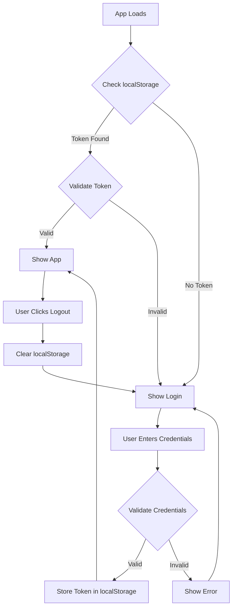

# Design Document

## Overview

This design implements a simple client-side authentication system using localStorage for session persistence. The system will protect all application routes with a login gate, requiring users to authenticate before accessing any content. The authentication state will be managed through React context and localStorage for persistence across browser sessions.

## Architecture

The authentication system follows a layered approach:

1. **Authentication Context Layer**: Manages global authentication state using React Context
2. **Route Protection Layer**: Higher-order component that wraps protected routes
3. **Login Component Layer**: Handles user credential input and validation
4. **Storage Layer**: Uses localStorage for session persistence
5. **Configuration Layer**: Stores authentication credentials securely

### Authentication Flow



## Components and Interfaces

### AuthContext

**Purpose**: Provides global authentication state management

**Interface**:
```javascript
interface AuthContextType {
  isAuthenticated: boolean;
  login: (username: string, password: string) => Promise<boolean>;
  logout: () => void;
  loading: boolean;
}
```

**State Management**:
- `isAuthenticated`: Boolean indicating current auth status
- `loading`: Boolean for initial auth check
- Authentication token stored in localStorage with key `auth_token`

### AuthProvider Component

**Purpose**: Wraps the entire application to provide authentication context

**Responsibilities**:
- Initialize authentication state from localStorage on mount
- Provide login/logout methods to child components
- Manage loading states during authentication operations

### ProtectedRoute Component

**Purpose**: Higher-order component that protects routes from unauthorized access

**Behavior**:
- Renders children if user is authenticated
- Redirects to login if user is not authenticated
- Shows loading spinner during initial auth check

### LoginForm Component

**Purpose**: Handles user credential input and authentication

**Features**:
- Username and password input fields
- Form validation (required fields)
- Error message display
- Loading state during authentication
- Responsive design matching existing UI

**Validation Rules**:
- Username: Required, minimum 1 character
- Password: Required, minimum 1 character

### AuthService

**Purpose**: Handles authentication logic and credential validation

**Methods**:
```javascript
class AuthService {
  static validateCredentials(username, password): boolean
  static generateToken(): string
  static isValidToken(token): boolean
  static clearAuthData(): void
}
```

## Data Models

### Authentication Token
```javascript
interface AuthToken {
  value: string;        // Random generated token
  timestamp: number;    // Creation timestamp
  username: string;     // Authenticated username
}
```

### Credentials Configuration
```javascript
interface AuthConfig {
  username: string;     // Valid username
  password: string;     // Valid password (stored as plain text for simplicity)
}
```

**Default Credentials**:
- Username: `admin`
- Password: `password123`

**Storage Location**: Hardcoded in AuthService for simplicity, can be moved to environment variables later

## Error Handling

### Authentication Errors
- **Invalid Credentials**: Display user-friendly error message
- **Network Errors**: Handle gracefully with retry option
- **Storage Errors**: Fallback to session-only authentication

### Error Messages
- "Invalid username or password"
- "Please fill in all fields"
- "Authentication failed. Please try again."

### Error Recovery
- Clear invalid tokens automatically
- Provide clear path back to login
- Maintain user experience during errors

## Testing Strategy

### Unit Tests
- AuthService credential validation
- Token generation and validation
- localStorage operations
- Form validation logic

### Integration Tests
- Login flow end-to-end
- Route protection behavior
- Session persistence across page refreshes
- Logout functionality

### Component Tests
- LoginForm rendering and interaction
- AuthProvider state management
- ProtectedRoute conditional rendering
- Error state handling

### Manual Testing Scenarios
1. **Fresh Install**: Verify login required on first visit
2. **Valid Login**: Confirm access granted with correct credentials
3. **Invalid Login**: Verify error handling with wrong credentials
4. **Session Persistence**: Test auth state after page refresh
5. **Logout Flow**: Confirm complete session cleanup
6. **Route Protection**: Verify all routes require authentication
7. **Browser Storage**: Test behavior with localStorage disabled

## Security Considerations

### Client-Side Limitations
- Credentials are stored in client-side code (acceptable for simple use case)
- No server-side validation (suitable for static deployment)
- localStorage tokens can be inspected (trade-off for simplicity)

### Mitigation Strategies
- Use environment variables for production credentials
- Implement token expiration for enhanced security
- Clear sensitive data on logout
- Validate authentication state on each route change

### Future Enhancements
- Server-side authentication integration
- Password hashing
- Multi-factor authentication
- Session timeout handling