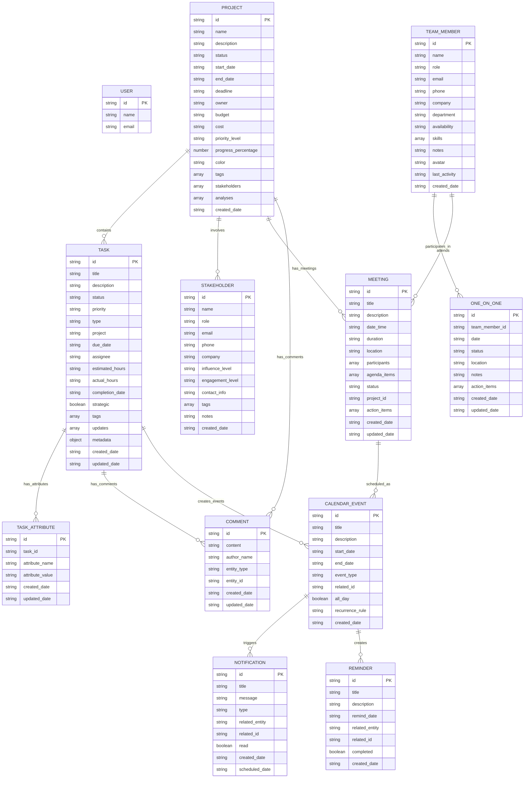

# P&E Manager - Entity Relationship Diagram (Updated)

## Core Entities and Relationships

## Detailed Entity Descriptions

### 1. **USER** (Local User Entity)
- **Purpose**: Represents the local application user
- **Storage**: Not persisted (hardcoded local user)
- **Relationships**: Implicit owner of all data

### 2. **PROJECT** 
- **Purpose**: Main organizational unit for work
- **Key Fields**:
  - `status`: not_started, in_progress, on_hold, completed
  - `stakeholders`: Array of stakeholder IDs
  - `analyses`: AI-generated project analyses
- **Relationships**:
  - One-to-many with Tasks (via `task.project` field)
  - Many-to-many with Stakeholders (via `project.stakeholders` array)

### 3. **TASK**
- **Purpose**: Individual work items and activities
- **Key Fields**:
  - `type`: meeting, action, metric, etc.
  - `project`: String reference to project name
  - `metadata.meeting.participants`: Array of team member names
  - `updates`: Array of progress updates
- **Relationships**:
  - Many-to-one with Project (via `project` field)
  - Implicit many-to-many with Team Members (via meeting participants)

### 4. **TEAM_MEMBER**
- **Purpose**: People involved in projects and meetings
- **Key Fields**:
  - `availability`: full_time, part_time, contractor, remote
  - `skills`: Array of skill tags
- **Relationships**:
  - Implicit many-to-many with Tasks (via meeting participants)
  - One-to-many with OneOnOne sessions

### 5. **STAKEHOLDER**
- **Purpose**: External parties with project interest
- **Key Fields**:
  - `influence_level`: High, Medium, Low
  - `engagement_level`: Active, Passive, Resistant
- **Relationships**:
  - Many-to-many with Projects (via project.stakeholders)

### 6. **ONE_ON_ONE**
- **Purpose**: Individual meeting records
- **Relationships**:
  - Many-to-one with Team Members

### 7. **TASK_ATTRIBUTE**
- **Purpose**: Extended metadata for tasks
- **Relationships**:
  - Many-to-one with Tasks

## Key Relationship Patterns

### Project-Centric Organization
- Projects are the primary organizational unit
- Tasks belong to projects via string reference (`task.project = project.name`)
- Stakeholders are associated with projects via array references

### Flexible Team Collaboration
- Team members are linked to tasks through meeting participants
- No rigid assignment structure - allows for flexible collaboration
- Meeting-based task tracking captures actual participation

### Tag-Based Categorization
- Multiple entities use tag arrays for flexible categorization
- Projects, Tasks, and Stakeholders all support tagging
- Enables cross-cutting concerns and filtering

### Temporal Tracking
- All entities have creation timestamps
- Tasks have both created and updated dates
- Project analyses include timestamps for historical tracking

## Data Flow Patterns

1. **Project Creation** → **Task Assignment** → **Team Collaboration**
2. **Stakeholder Identification** → **Project Association** → **Engagement Tracking**
3. **Meeting Planning** → **Participant Assignment** → **Task Creation**
4. **Progress Updates** → **Task Status Changes** → **Project Progress Calculation**

## Storage Implementation
- All data stored in browser localStorage
- Each entity type has its own storage key
- No foreign key constraints - relationships maintained through naming conventions
- Soft references allow for flexible data management